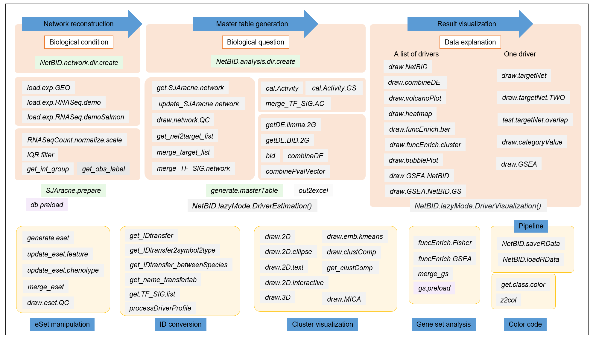

## User guide

### Design manual

The manual of all the NetBID functions is linked here [NetBID_manual.pdf](https://github.com/jyyulab/NetBID-dev/blob/master/NetBID_manual.pdf). 
Every function has its own demo scripts to demonstrate its functionality.

By design, functions in NetBID2 R packages can be grouped into the following function modules: 1) three main steps: Network reconstruction, Driver inference (Master table generation), and Result visualization; 2) supporting modules: eSet manipulation, ID conversion, Cluster visualization, Gene set analysis, color code and Pipeline.

As several calculation steps and lots of datasets are included in the driver analysis, NetBID2 has provided several functions to assist pipeline and data management. 

**Here are 4 functions ESSENTIAL for the NetBID2 pipeline management:**

- `NetBID.network.dir.create()` helps users to create an organized working directory for the network reconstruction step in NetBID analysis. It creates a hierarchical working directory and returns a list containing information about this directory. 

- `NetBID.analysis.dir.create()` helps users to create an organized working directory for the driver inference (master table generation) step in NetBID analysis. Similarly, it also creates a hierarchical working directory and returns a list containing information about this directory.

- `NetBID.saveRData()` helps users to save the main list object (e.g network.par, analysis.par, described below) containing complicated datasets into one RData format file, named by the step code. This function assists users to control step calculation and avoid possible missing.  

- `NetBID.loadRData()` pairs with `NetBID.saveRData()`, it reloads previous saved Rdata.

**Here are 2 list objects ESSENTIAL for the NetBID2 pipeline analysis:**

- `network.par` is a variable in the **network reconstruction part**. It is created by `NetBID.network.dir.create()` with network reconstruction directory information wrapped inside. This list object is used to store all the important results from the network reconstruction pipeline. It can be saved as RData and reloaded back using `NetBID.saveRData()` and  `NetBID.loadRData()`.
- `analysis.par` is a variable in the **driver inference part (master table generation)**. It is created by `NetBID.analysis.dir.create()` with driver inference directory information wrapped inside. This list object is used to store all the important results from the driver inference pipeline. It also can be saved as RData and reloaded back using `NetBID.saveRData()` and  `NetBID.loadRData()`.

The NetBID2 pipeline is summarized in the figure below,

**We highly suggest new users to follow the pipeline for driver analysis and visualization.** Details of the NetBID2 pipeline is shown and explained using a demo dataset in the following tutorial.
Of course, most functions in NetBID2 are still flexible to use and perform specific needs for users.

## Demo dataset
 
We choose the demo dataset from GEO database: [GSE116028](https://www.ncbi.nlm.nih.gov/geo/query/acc.cgi?acc=GSE116028). 

This microarray dataset contains 13 adult medulloblastoma (MB) samples. 
Three phenotype subgroups of adult MB have been identified from expression profiles, clinical features, pathological features and prognosis.
These subgroups together with their sample numbers are, 3 SHH, 4 WNT, and 6 Group4.
Group4 tumors in adult have significantly worse progression-free and overall survival, compared to other molecular subtypes of tumor.
Here, the goal is to **find potential drivers in Group4 compared to other subtypes using NetBID analysis**. This may relate to specific clinical feature of Group4 MB subtype.
 
**Though the dataset in the tutorial is microarray, NetBID2 is also capable to analyze RNA-Seq data. We will show in the tutorial as well.**  
 
The tutorial contains three main parts, they can be followed by order or used independently:

1. [Network reconstruction](../docs/network_reconstruction)

2. [Driver inference (master table generation)](../docs/driver_inference)

3. [Advanced analysis (result visualization)](../docs/advanced_analysis)

